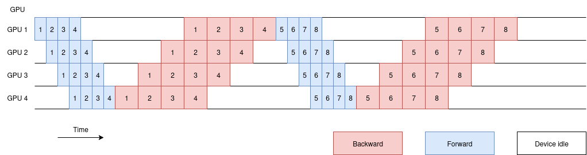
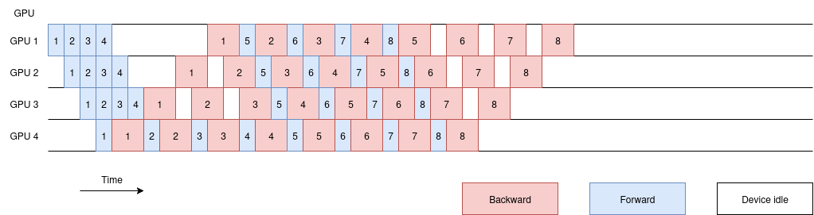
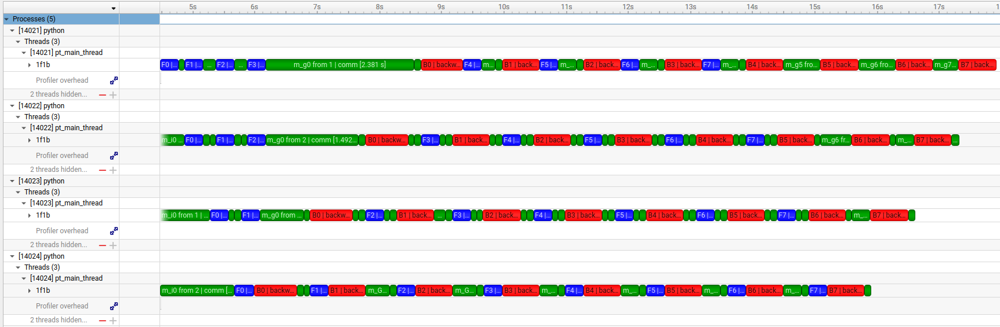
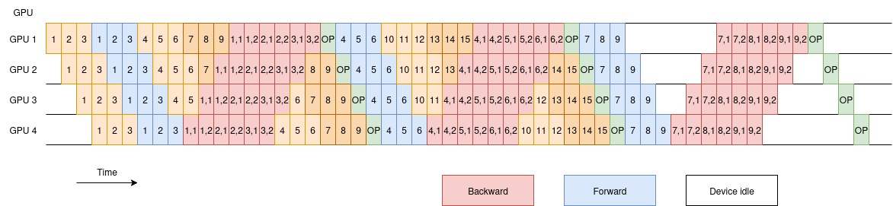
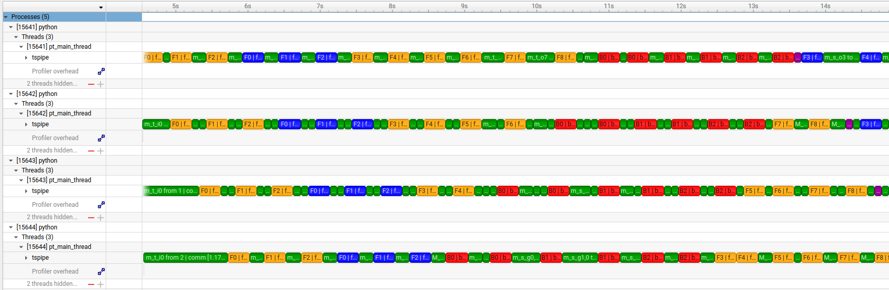

# pipeline-parallelism-from-scratch

In this repo we i implement different scheduling techniques such as Gpipe, 1F1B and TSPipe.

# Gpipe
Gpipe's principle is to split the model into stages and pipeline the microbatches across these stages. Doing all forwards before doing all backwards. That is why Gpipe is also called all forward all backward (AFAB).

The theoritical scheudling graph is the following:

The practical implementation of Gpipe is the following:

*Currently not available*

# 1F1B

1F1B stands for 1 Forward 1 Backward. It is a scheduling technique that allows for more efficient use of resources by interleaving the forward and backward passes of different microbatches.

The theoritical scheduling graph is the following:

The practical implementation of 1F1B is the following:

# TSPipe

TSPipe is a scheduling technique specifically made for Teacher Student type of algorithms such as knoledge distillation.

Source : https://proceedings.mlr.press/v162/lim22a/lim22a.pdf

The practical implementation of TSPipe is the following:

